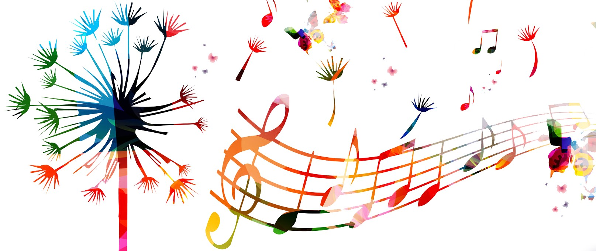
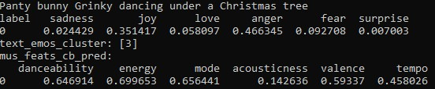
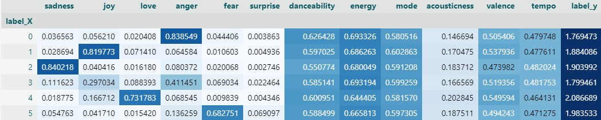
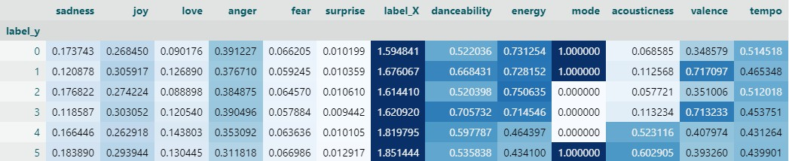
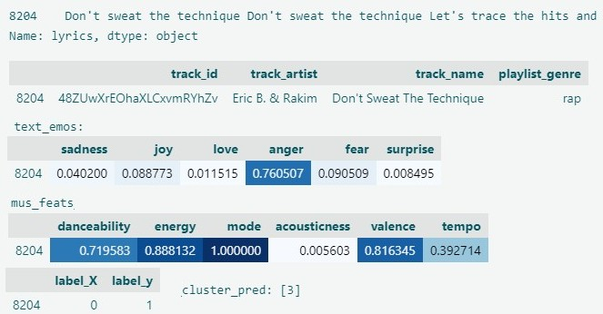
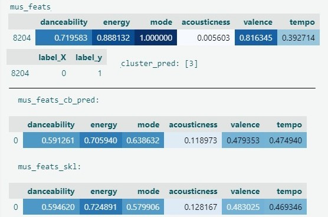

# **Музыка в ответ на эмоции**

***подбираем музыку по эмоциям,
распознанным из поданного текста или звука***

**Прототип:**
> [@Dnld_YT_mp3_bot](https://t.me/dnld_yt_mp3_bot)  
команда [/emo]()  


<br>


### **Предпосылки**

* **Музыка** -- это особый род языка, призванный
   * **выразить и вызвать** состояния 🕺, эмоции 🎭 и мысли 💬
   * в **концентрированном** 💪 виде

* **Текст 📃, интонации 🗣 и мелодические линии 🎶**
   * -- это главные носители музыкальных смыслов

* **Базовые состояния** в нас 🎭 и в музыке 🎼 -- ядро работы
   * спокойное 🏖 -- энергичное 🚀
   * грустное 😢 -- радостное 😁


<br>

## **Маркетинговые идеи для production**

### 1. Широкой аудитории: 
   * расскажи мне, что ты чувствуешь (в текстовом и/или звуковом сообщении)  
   😁 😢 🥰 😠 😨 😲 
   * я подберу соответствующую музыку. Она отразит твое состояние и поможет его выразить.  
   🎶 🎺 🎹 🎙


#### Демо-прототип: Telegram бот
> [@Dnld_YT_mp3_bot](https://t.me/dnld_yt_mp3_bot)  
команда [/emo]()


      * Ввели: `Трусишка зайка серенький под елочкой плясал`
      * Получили на "панели приборов":  



### 2. Блогерам и подражающим им: 
   * пришли мне звуковую дорожку с голосом, голосовое сообщение или видео 
🧑 🎤
   * я подберу фоновую музыку по настроению присланного и подложу ее под твой голос.
🎼 🔊 🎛 🎦 

<br>

---

<br>

## **Data Science проект**
#### **Данные:**
* датасет с открытыми данными **Spotify** и текстами песен 📃
   * более 17 тыс. популярных песен разных стилей
* отобранные **музыкальные признаки** 🎼:

| danceability | energy | mode | acousticness | valence | tempo | 
| :-: | :-: | :-: | :-: | :-: | :-: |
| танцевальность 🕺 | энергичность 🚀 | мажор/минор ☯ | интрументальность 🎻 | позитивность 🎉 | темп 🏃 | 

<!---positive (happy, cheerful, euphoric) --->
<!---negative (sad, depressed, angry) --->

---

### **Задачи:**
1. Исследовать взаимосвязь ↔ между 
   * эмоциями 🎭, заложенными в музыке и 
   * муз. признаками 🎼 от Spotify соответствующих песен
2. Получить  предсказания эмоций 🎭 пользователя
3. Предложить максимально соответствующую музыку 🎼


### **Pipeline**

* Данные ⚪
   * Датасеты 📃🎼, Звуковые файлы 🔊, Сообщения 💬
* Модели DL и ML 🔵
   * Распознавание эмоций 🎭 из текста 📃 и звука 🔊
   * MultiOutput регрессия (6 эмоций на 6 муз. признаков)
   * Кластеризация эмоций 🎭 и муз. признаков 🎼

[](pres_pics/PipeLine_MbE.gif)


<br>

---

<br>

## **Что сделано**

### 1. Получены предсказания предобученной модели об эмоциях 🎭, заложенных в музыке, исходя из соотв. **текстов песен 📃**.

```
bhadresh-savani/albert-base-v2-emotion     # best for "text --> emotions"
```


---

### 2. Сделана **кластеризация** отдельно: 
    * предсказанных эмоций текста 🎭📃 и 
    * музыкальных признаков 🎼 от Spotify
    * цель -- **естественная группировка материала** 
### 3. Создан **сводный датасет** с указанием обоих кластеров для каждого произведения.



---

### 4. Анализ сводного датасета показал: 
####  a) при усредняющей группировке **по кластерам эмоций** 🎭➋
      * концентрацию большьшинства эмоций в **разных** кластерах
      * при этом все музыкальные признаки оказались **равномерно распределены** по кластерам эмоций.
      * среднее значение музыкального кластера 🎼➋  -- **2**


      * -> **слабость связей** между эмоциями 🎭  и муз. признаками 🎼
         * невысокая точность взаимных предсказаний 🎭<-->🎼
      * --> **кл. 2 -- это центр 🎯 музыки в плоскости эмоций 🎭**
         * некое "музыкальное коллективное бессознательное" 💭
         * **константа**, которая нам пригодится


####  б) при усредняющей группировке **по муз. кластерам** 🎼➋
      * **центральный кластер 2 отличается**
        * негативностью 😱, не-танцевальностью 👮, энергичностью 🚀, быстротой темпа ⏱, не-интструм. 🗣


      * хорошая **поляризация** ☯ признаков по кластерам (6x6)
      * **корреляции ∥∦** эмоций 🎭 и муз. признаков 🎼
        * гнев (решительность) 🔥   <-->  энергичность 🚀
        * радость 😁 ∥  позитивность🎉 ∦ грусть 😢
        * Это и есть **базовые состояния**, кот. выражает музыка (🏖🚀 😢😁)
      * Свести к ним педсказания? -- Не хочется упрощать.



   --> Ожидаем **базовую сходимость 🧮** в предсказаниях муз. признаков по эмоциям 🎭 --> 🎼


### 5. Педсказание муз. признаков (6) по эмоциям (6) 🎭 --> 🎼
   * модели `CatBoostRegressor` и `MultiOutputRegressor` (от Scikit-learn, на эстиматоре GradientBoostingRegressor)
   * метрики 🧮: затрудненный подбор и интерпретация 
   * результаты предсказаний обеих моделей -- мало отличимы

| model | (Multi)RMSE | R2 | 
| :- | :-: | :-: |
| CatBoostRegressor | 0.64 | -- |
| MultiOutputRegressor | 0.23 | 0.02 |


### 6. Ручное тестирование
   * берем песню из тестовой выборки  



6. Ручное тестирование
   * **реальные** муз. признаки и кластер 🎼➋ / **предсказанные**  


<br>

---

<br>


## **Как улучшить работу моделей?**
   * -->  **поработать с предсказаниями эмоций 🎭**
      * сделать предсказания **по звуку 🔊** песен

```
Aniemore/Russian-Emotion-Recognition     # best for "sound --> emotions"
```


### 7. Создана выборка в 300 примеров,
   * сбалансированная по музыкальным кластерам 🎼➋ (50 шт. из кластера)

### 8. По скачанным звуковым файлам песен получены предсказания эмоций 🎭 для
   * песен без обработки звука 🔊, с 40 по 100 сек. 
   * выделенной голосовой партии 🎙
### 9. Создан сводный датасет (300 песен) всех предсказаний и кластеров 
   * 🎭(📃 🔊 🎙)__🎭➋__🎼__🎼➋


[](pres_pics/voice_sound_vert.jpg)


### 10. Педсказание напрямую муз. кластеров по эмоциям 🎭 --> 🎼➋
   * Цель -- на уверенной метрике выбрать лучшие комбинации признаков эмоций 🎭(📃 🔊 🎙)
   * Регрессия от CatBoost: для 95% песен предсказан
      * центральный 🎯 муз. **кластер 2** 🎼➋, константа и опора
 
   * Составляющие протестированных вариантов:
      * 📃  -- эмоции текста (😁 😢 🥰 😠 😨 😲)
      * 🔊  -- эмоции звука без обработки (😁 😢 😠 😨 🤢✌ 😐)
      * 🎙  -- эмоции звука выделенной голосовой партии
      * ✂📃   -- не конкурирующие эмоции текста (🥰 😲)

<!--- + отвращение и энтузиазм --->


| Комбинация | MAPE |
| :- | :-: |
| 🔊 | **0.242** | 
| (🔊+🎙)/2 __ ✂📃 | **0.242** | 
| (🔊+🎙)/2 __ 📃 |	0.248 | 
| 🎙 __ ✂📃	| 0.251 | 
| 🎙	| 0.253 | 
| 🔊 __ ✂📃	| 0.255 | 
| 📃 (15000)	| 0.263 | 
| 📃 (300)	| 0.279 | 


[](pres_pics/Music-Affects-Our-Emotions.jpg)

<br>

---

<br>

## **Выводы для production**
   1. **Музыкальные признаки** 🎼 произведений, предлагаемые Spotify, **не могут служить надежной опорой** 🧮 для определения эмоций 🎭 произведения.

   2. Чтобы предложить "городу и миру" сервис подбора песен по эмоциям, необходимо:
      * кластеризировать эмоции 🎭 из их текста 📃и звука 🔊
      * кластеризировать музыкальные признаки 🎼 
      * предлагать **имеющиеся** в сете песни **на пересечении кластеров** эмоций 🎭➋ и музыкальных признаков 🎼➋


   3. Для подбора **фоновой инструментальной** 🎻 музыки можно пробовать **запрашивать в Spotify рекомендации**, отправляя:
      * 3-5 примеров из кластера эмоций 🎭➋
      * предсказания музыкальных признаков 🎼➋ (как целевые параметры)
      * желаемый уровень инструментальности 🎻


[](pres_pics/Music-Mood-Emotions.webp)


<br>
<br>

> &copy; Андрей Кукунов  
ментор: Леонид Саночкин
