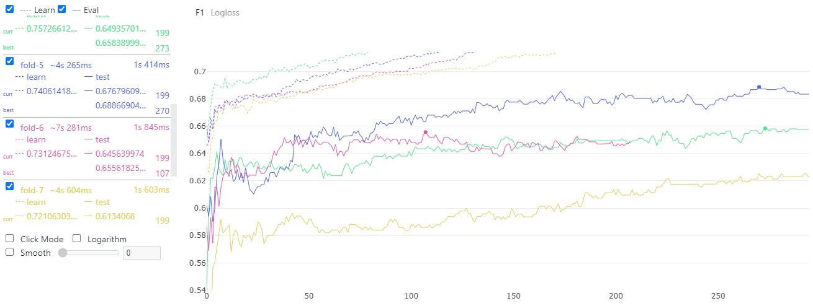
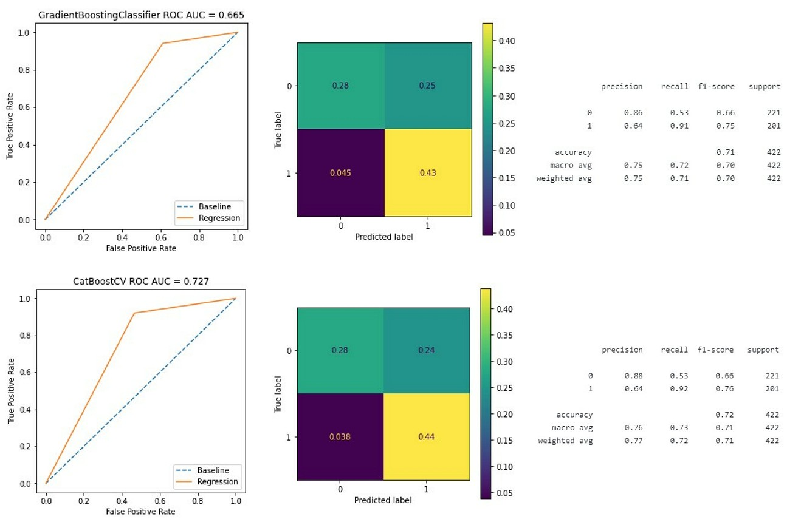
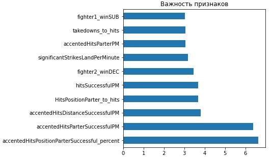

# Межгалактический хакатон 2022

[Презентация проекта совместной работы](Hackathon_UFC_Presentation.html)

[Подробное описание проекта совместной работы](https://github.com/gravek/Skillfactory/tree/master/Hackathon_UFC)

 

## Цель данного Data Science проекта
 * Посторить модель машинного обучения на подготовленных данных о боях UFC
 * Достичь наилучших показателей по метрикам

 

## Результаты работы:

### Наилучшей моделью оказалась CatBoost CV: 

- кросс-валидация 
- на 10 под-выборках
- построенная по принципу TimeSeries 
- с автоматической балансировкой классов
- без отбора самых значимых признаков

#### Для тестовой выборки была отобрана под-модель 'fold 5'

#### Метрики тестовой выборки:  

#### Самые значимые признаки в этой модели:

    

### Также были опробованы модели:
> * RandomForestClassifier
> * GradientBoostingClassifier
> * CatBoostRegressor

 

--------------------------------------------------------------