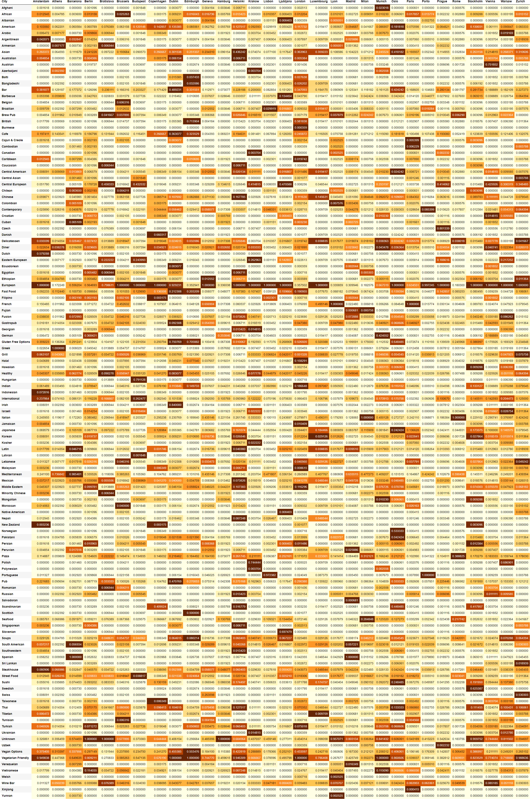

# Restaurant rating prediction (at Trip Advisor)

## или EDA в Случайном Лесу ресторанов

### or ED'ing in the Random Forest of Restaurants

**The purpose of this training Data Science project** is to process data from [Trip Advisor](https://www.tripadvisor.com/) to:

> - predict, based on the parameters and ratings of trusted restaurants, what rating a different restaurant might have with the parameters you have.
> - get some interesting information about the restaurant business and cuisine styles on a global scale.

**Цель данного учебного Data Science проекта** -- сделать такую _обработку данных_ с сайта [Trip Advisor](https://www.tripadvisor.com/), чтобы:

> - на основе данных о параметрах и рейтинге доверенных ресторанов предсказать, какой рейтинг может иметь некий иной ресторан с имеющимися у вас параметрами
> - получить немного интересной информации о ресторанном бизнесе и кулинарных стилях в мировом масштабе

> ---------------------------------

## Some facts
- The machine learning model used was Random Forest Regressor from Scikit-learn.
- The average deviation of the predicted values **0.1616 MAE** (Mean Absolute Error) from the actual values
- The work is competing on Kaggle (link)
- [**You can also see it here**](https://www.tripadvisor.com/)

### Некоторые факты
- Использовалась модель машинного обучения Random Forest Regressor от Scikit-learn.
- Удалось добиться среднего отклонения предсказанных значений  **0.1616 MAE** от фактических
- Работа участвует в соревновании на [Kaggle]https://www.kaggle.com/andreikukunov/baseline-sf-tripadvisor-rating-v2-7)
- Также можно ознакомиться с ней [здесь](https://www.kaggle.com/andreikukunov/baseline-sf-tripadvisor-rating-v2-7)

 

> 

## Below you'll see the analytics of the dataset used in this job.
### Ниже приведена аналитика датасета, использованная в работе.

### [INDEX / оглавление](#sec0)

4. [Little bit of ANALYTICS / (русская версия аналитики -- ниже)](#sec4)   
    * [4.1  The Elusive Rating and it's entourage](#sec4.1)     
    * [4.2  What are the Rating's friends](#sec4.2)          
        * [4.2.1  City](#sec4.2.1)
        * [4.2.2  Ranking: Restaurant rank in the city](#sec4.2.2)
        * [4.2.3  Number of Reviews](#sec4.2.3)
        * [4.2.4  Reviews: A couple of reviews for the restaurant](#sec4.2.4)
        * [4.2.5  Cuisine Style](#sec4.2.5)
        * [4.2.6  ID_TA: Trip Advisor restaurant ID](#sec4.2.6)
        * [4.2.7  Restaurant_id — Restaurant / restaurant chain identification number](#sec4.2.7)
        * [4.2.10  Popularity of culinary styles in each city](#sec4.2.10)

   
    
5. [Немного аналитики / (English version of anaytics is upper)](#sec5) 

    * [5.1  Неуловимый Рейтинг](#sec5.1)
    
    * [5.2  С чем дружит Рейтинг](#sec5.2)          
        * [5.2.1  City: Город](#sec5.2.1)
        * [5.2.2  Ranking: Ранг ресторана в городе](#sec5.2.2)
        * [5.2.3  Number of Reviews: Количество отзывов о ресторане](#sec5.2.3)
        * [5.2.4  Reviews: Парочка отзывов о ресторане](#sec5.2.4)
        * [5.2.5  Cuisine Style: Кулинарные стили (кухни)](#sec5.2.5)
        * [5.2.6  ID_TA: Идентификатор ресторана на Trip Advisor](#sec5.2.6)
        * [5.2.7  Restaurant_id — идентификационный номер ресторана / сети ресторанов](#sec5.2.7)
        * [5.2.10  Популярность кулинарных стилей в каждом городе](#sec5.2.10)

----------------
----------------

GO TO [INDEX / оглавление](#sec0) 

# Little bit of analytics

## [русская версия аналитики -- в следующем разделе (ссылка)](#sec5)

**(Dedicated to survivors / посвящается выжившим)**

## The Elusive Rating and it's entourage

So, the main goal of this work is --

> to investigate **what affects the rating** of restaurants on 'www.tripadvisor.com' and train the ML model to **predict or verify** the rating of other restaurants.

Let's look at our target variable with the rating in the training sample, **how its values are distributed**:

- general range of values from 1 to 5 in increments of 0.5
- the middle values are concentrated around 4
- most of the values are concentrated from 3.5 to 4.5
- values, which also cannot be ignored, range from 2 to 5
- some drop down values are at 1.5 and 1

> **It's just like a regular school with a regular student!**

### And here is the context of the variables,

among which our rating happens to be and which should help us determine it: 

#### What features do we have initially:

- City
- Cuisine Style
- Ranking: The restaurant's rank in relation to other restaurants in the city
- Price Range: Restaurant prices in 3 categories
- Number of Reviews
- Reviews: Last 2 reviews and dates of reviews
- URL_TA: The restaurant's page on 'www.tripadvisor.com'.
- ID_TA: TripAdvisor restaurant ID
- Rating: Rating of the restaurant

### Let's see a random restaurant

  > This is the Augustiner Schützengarten from Munich

        > Restaurant_id: id_615 

        > City: Munich 

        > Cuisine Style: ['German', 'Central European', 'Vegetarian Friendly'] 

        > Ranking: 621.0 

        > Rating: 4.0 

        > Price Range: $$ - $$$ 

        > Number of Reviews: 84.0 

        > Reviews: [['Best place to try a Bavarian food', 'Nice building but improvements need to be...'], ['11/18/2017', '02/19/2017']]"

        > URL_TA: /Restaurant_Review-g187309-d6864963-Reviews-Augustiner_Schutzen_Garten... 

        > ID_TA: d6864963

Website address:

  <https://www.tripadvisor.ru/Restaurant_Review-g274924-d1112354-Reviews-Massimo_Ristorante-Bratislava_Bratislava_Region.html>

**A little observation:**

> It turned out to be a **strong middle man** and, looking ahead, it uses the **most trending culinary styles** (cuisines) in his city. And not the worst for the restaurant business. 

-----
GO TO [INDEX / оглавление](#sec0)

## What are the Rating's friends
**Variables** (including those created in this job) that **most affect** the guessing of the rating
- The most important attributes for the model (according to its report)

- Useful attributes for MAE (empirically identified)

-----
GO TO [INDEX / оглавление](#sec0)

## City
The "City" feature has the **strongest effect** on model performance. Without it, the prediction accuracy drops **to 50%**!

Cities are the *environment in which a restaurant operates. And everything by which its success and rating can be measured, is determined by local conditions.

> Therefore, **general feature values** in this job are **normalized to urban** ones.
#### Вот города c самым лучшим средним рейтингом ресторанов (top-10):
> можно ехать!

#### Welfare (GDP per capita) 
- Simple logic, it would seem: 
  - The more free money a person has, the more he can port for nice services
  - the greater is the attendance and number of restaurants
  - the greater the competition between them
  - and the higher the quality of those services and, therefore, the higher the rating.

##### What does the Rating think about this?
- We see the greatest concentration of GDP values around 40 - 50 thousand.
- For all rating values 
- (see below correlation Rating <--> GDP)

##### How did the trait with GDP affect the performance of the model? 
> Notably, but inconsistently: 
> - with basic processing -- positively 
> - with maximal processing -- negatively

-----
GO TO [INDEX / оглавление](#sec0)

## Ranking: Restaurant rank in the city
among other restaurants (of this city)
> less number - better rank
#### Let's look at the distribution of the raw rank feature
This is the top 10 cities by rank, where:
- X-axis is the ranks of the restaurants in the city
- The Y axis is the number of restaurants with close rank values

#### And here is the distribution of the Ranks trait reduced to a common scale (normalized to 1):
> This variant of the feature turned out to be **the most influential** in this model (in it's opinion), nevertheless, the raw Ranks feature is also left "for the greater importance" of both. It's worse without it.

#### Let's look at the distribution of Rank relative to Rating
- On average, restaurants with a rating of 5 have a higher rank than
- Restaurants with a rating of 3, which also indicates the power of this attribute

------------
GO TO [INDEX / оглавление](#sec0)

## Number of reviews on the restaurant

#### Let's see how many restaurants we have with how many reviews (top-50):
- and we see that people aren't really in a hurry to leave reviews (what a surprise!):
 - the maximum number of restaurants has 2 reviews each!
 - As the number of reviews is increasing, number of restaurants with them -- is decreasing

#### How do the number of reviews correlate with restaurant ratings?
- We see the highest number of reviews for restaurants with a rating of 4 and 4.5!
- That number **reaches 10,000**!
- **It's hard to believe the reviews aren't inflated...**
- **And the rating doesn't seem to "think" about it!**
> In fact, **attempting to correct** such numbers (as "outliers") for reasonable numbers, **doesn't have a positive effect on the performance of the model**...

----------------
GO TO [INDEX / оглавление](#sec0)

## Reviews: A couple of them for the Restaurant
#### It would seem: what can we get from just two reviews?
> But we did!

- We were able to distinguish **the difference between the dates** of these reviews
- And that gave us a **significant increase** in the quality of the model's work!

> This means that **response from the visitors**, as a measure of the strength of the impression made, is important to Trip Advisor. 

> They're right: being able to surprise is an important part of competitiveness and, therefore, the development of both the business and the industry.

**However, the overwhelming (downright crushing) majority of the reviews are written 1 ("one") day apart!**
> **And the rating likes it!**

#### Duplicated reviews:
> if they are restaurants of different nets - it's a bad sign!

- Total duplicates:  6484
- Intra-network duplicates: 1630
- Are the rest of them **stealed reviews**?
- And that's **20% of the selection**!

**And the Rating doesn't care!**

-------------------
GO TO [INDEX / оглавление](#sec0)

## Cuisine Style
> **One of the most important components of the rating**

### I created a table with data on the popularity of culinary styles in each city
>*it is very fascinating!

[The full version of this table is below, at the end of the analytics section](#sec4.2.10)    <--- it's a link, if you mind

#### In the meantime -- here are the Top 10 cities with the greatest variety of popular cuisines
- The darker the color, the more popular is the cuisine in the city.
- The more to the left, the greater is the variety of popular styles and their concentration.

- It's not hard to see that European and vegetarian cuisines take the lead.
> And yes, this is Europe.

#### Also, each restaurant was given a score for the trendiness of its cuisine (in the city)
**What do we see?**
- A significant portion of the restaurants stick to **the main cuisine in town, and only that**!
- A sizable portion combines various secondary cuisines (middle of the range)
- And a **small portion of the restaurants don't hit the trends** of the city (right side of the chart) ... 

-----------------
GO TO [INDEX / оглавление](#sec0)

## ID_TA: Restaurant ID on Trip Advisor
#### Mysterious feature with its power 
> *It's just -- affecting ...**

-----------------
GO TO [INDEX / оглавление](#sec0)

## Restaurant_id - restaurant net's identification number
#### Must be a useful attribute, because:
> The **larger is the net**, the broader it spreads across the country and the world, **the more sustainable** is the business, and more opportunities should it have to **influence the rating** positively.

**Number of restaurants in the networks**

#### A new feature was made based on this one, with **the number of restaurants in the chain**.
> But the created one **did not affect the model much**.

#### It was interesting to find out (in detail) how many restaurants has a net in:
 * each city
 * in the country 
 * and in the world
 
(here is the code for [created attributes](#sec1.3.1))

#### BUT:
> We find **a lot of duplicates**! How many of them are there!?

#### Almost all the restaurants in the selection (49981 of 50000) have 1 restaurant each in the one city, one country, and (one) world! That's such a selection!
> Interesting features did not take place! Columns are not included in the model...

----------------------
----------------------
GO TO [INDEX / оглавление](#sec0)

# Немного аналитики
### [(English version of anaytics is in the previous section)](#sec4)

## Неуловимый Рейтинг и его окружение
Итак, основная цель данной работы -- 
> исследовать, **что влияет на рейтинг** ресторанов на портале 'www.tripadvisor.com' и обучить модель МО **предсказывать или проверять** рейтинг других ресторанов.

Посмотрим на нашу целевую переменную с рейтингом в тренировочной выборке, **как распределены ее значения**:
 - общий размах значений от 1 до 5 с шагом 0,5
 - серединные значения сосредоточены в районе 4
 - большая часть значений сосредоточена от 3,5 до 4,5
 - значения, которые тоже нельзя не учитывать, простираются от 2 до 5
 - отдельные выпадающие значения относятся к 1,5 и 1
 
**Вобщем, как в обычной школе у обычного ученика!**

### А вот -- тот контекст переменных,
среди которых оказался наш рейтинг и которые должны нам помочь его определить:

#### Какие признаки мы имеем изначально:
* City: Город 
* Cuisine Style: Кухня
* Ranking: Ранг ресторана относительно других ресторанов в этом городе
* Price Range: Цены в ресторане в 3 категориях
* Number of Reviews: Количество отзывов
* Reviews: 2 последних отзыва и даты этих отзывов
* URL_TA: страница ресторана на 'www.tripadvisor.com' 
* ID_TA: ID ресторана в TripAdvisor
* Rating: Рейтинг ресторана

### Посмотрим случайный ресторан
- Отзыв о нем полностью
- Адрес на сайте
> Это -- Augustiner Schützengarten из Мюнхена

        > Restaurant_id: id_615 

        > City: Munich 

        > Cuisine Style: ['German', 'Central European', 'Vegetarian Friendly'] 

        > Ranking: 621.0 

        > Rating: 4.0 

        > Price Range: $$ - $$$ 

        > Number of Reviews: 84.0 

        > Reviews: [['Best place to try a Bavarian food', 'Nice building but improvements need to be...'], ['11/18/2017', '02/19/2017']]"

        > URL_TA: /Restaurant_Review-g187309-d6864963-Reviews-Augustiner_Schutzen_Garten... 

        > ID_TA: d6864963

Адрес на сайте:

  
  https://www.tripadvisor.ru/Restaurant_Review-g274924-d1112354-Reviews-Massimo_Ristorante-Bratislava_Bratislava_Region.html

**Маленькое наблюдение:**
> Он оказался **крепким середнячком** и, забегая вперед, отметим, что использует **наиболее  трендовые кулинарные стили** (кухни) в своем городе. И не самом плохом для ресторанного бизнеса.

------------
GO TO [INDEX / оглавление](#sec0)

## С чем дружит Рейтинг
**Переменные** (в том числе созданные в этой работе), **наиболее влияющие** на угадывание рейтинга
- Самые важные признаки для модели (по ее отчету)

- Полезные для MAE признаки (эмпирически выявленные)

--------------
GO TO [INDEX / оглавление](#sec0)

## City: Город
Признак "Город" имеет **сильнейшее влияние** на работу модели. Без этого признака точность презсказания падает **до 50%**!

Города -- это  *среда, в которой действует ресторан*. И все, чем может быть измерен его успех и рейтинг, определяется местными условиями.

> Поэтому **общие значения признаков** в данной работе **нормализованы к городским**.

#### Вот города c самым лучшим средним рейтингом ресторанов (top-10):
> можно ехать!

#### Благосостояние (ВВП на душу населения)
- Простая логика, казалось бы: 
 - чем больше у человека свободных денег, тем больше он может портатить на приятные услуги
 - тем больше посещаемость ресторанов и их количество
 - тем выше конкуренция между ними
 - и выше качество этих услуг, а значит -- рейтинг

##### Что думает об этом сам Рейтинг?
- наибольшую концентрацию значений ВВП мы видим в районе 40 - 50 тыс.
- при любых значениях рейтинга 
- (см. ниже корреляцию Рейтинг <--> ВВП)

##### Как признак с ВВП повлиял на работу модели? 
> Заметно, но противоречиво: 
> - при базовой обработке -- положительно 
> - при максимальной обработке -- отрицательно

----------------
GO TO [INDEX / оглавление](#sec0)

## Ranking: Ранг ресторана в городе
среди других ресторанов (этого города)
> меньше цифра -- лучше ранг
#### Посмотрим на распределение необработанного признака Рангов
Это -- топ 10 городов по рангу, где:
- по оси X - ранги расторанов в городе
- по оси Y - количество ресторанов с близкими значениями ранга

#### А вот распределение приведенного к общему масштабу (нормализованного к 1) признака Рангов:
> Этот вариант признака оказался **самым влиятельным** в данной модели (по ее мнению), тем не менее, необработанный признак Рангов тоже оставлен "для пущей важности" обоих. Без него -- хуже.

#### Посмотрим распределение Ранга относительно Рейтинга
- в среднем, рестораны с рейтингом 5 имеют более высокий ранг, чем
- рестораны с рейтингом 3, что также говорит о силе влияния этого признака

-----------
GO TO [INDEX / оглавление](#sec0)

## Reviews: Количество отзывов о ресторане

#### Посмотрим, сколько ресторанов с каким количеством отзывов унас имеется (top-50):
- и увидим, что люди не особо торопятся оставлять отзывы (экий сюрприз!):
 - максимальное количество ресторанов имеет по 2 отзыва!
 - с увеличением количества отзывов снижается и количество ресторанов, обладающих ими

#### Как соотносится количество отзывов с рейтингом ресторанов?
- Максимальное количество отзывов мы видим у ресторанов с рейтингом 4 и 4,5!
- Это количество **достигает 10000** штук!
- *Трудно поверить, что оттзывы не накручены...*
- **И, кажется, рейтинг "не думает" об этом!**
> Ведь **попытка исправить** такие количества (как "выбросы") на разумные цифры, **не сказывается положительно на работе модели**...

--------------------
GO TO [INDEX / оглавление](#sec0)

## Reviews: Парочка Отзывов о ресторане
#### Казалось бы: что нам могут дать всего два отзыва о ресторане?
> А кое-что смогли!

- Удалось выделить **разницу между датами** этих отзывов
- И это нам дало значительный прирост в качестве работы модели!

> Это значит, что **ответная активность посетителей**, как показатель силы произведенного впечатления, важен для Trip Advisor. 

> И в этом они правы: умение удивить -- важная составляющая конкуреннтной борьбы, а значит и развития как отдельного бизнеса, так и отрасли вцелом.

**Однако, подавляющее (прямо раздавливающее) большинство отзывов написано с разницей в 1 (прописью: "один") день!**
> И рейтингу это нравится!

#### Дублирование отзывов:
> если это рестораны разных сетей -- плохой знак!

- Всего дублей:  6484
- Дублей внутри сети:  1630
- А остальные что, **воруют отзывы**?
- И ведь это **20% выборки**!

**А рейтингу все равно!**

------------------
GO TO [INDEX / оглавление](#sec0)

## Cuisine Style: Кулинарные стили (кухни)
> **Одна из важнейших составляющих рейтинга**

### Создана таблица с данными о популярности кулинарных стилей в каждом городе 
> **она очень увлекательна!**.

[Полный вариант этой таблицы представлен ниже, в конце раздела с аналитикой](#sec4.2.10)    <--- это ссылка, если что

#### А пока -- Top-10 городов с самым большим разнообразием популярных кухонь
- Чем темнее цвет, тем выше популярность кухни в городе.
- Чем левее, тем больше разннобразие популярных стилей, их концентрация

- Не трудно заметить, что лидерство у европейской и вегетарианской кухонь.
> И да, это -- Европа

sns.heatmap(City_Cuisines_top, annot = True, cmap='YlOrBr')
#### Также каждому ресторану был присвоен бал по трендовости его кухонь (в городе)
**Что мы видим?**
- Значительная часть ресторанов придерживается **главной кухни в городе, и только ее**!
- Заметная часть совмещает различные второстепенные кухни (середина диапазона)
- И **немалая часть ресторанов не попадает в тренды** города (правая часть графика). 

------------
GO TO [INDEX / оглавление](#sec0)

## ID_TA: Идентификатор ресторана на Trip Advisor
#### Таинственный в своей мощности признак
> **Он просто -- влияет...**

------------------
GO TO [INDEX / оглавление](#sec0)

## Restaurant_id — идентификационный номер ресторана / сети ресторанов
#### Должно быть, полезный признак, потому что:
> Чем **больше сеть**, чем шире она распространена по стране и миру, **тем устойчивей** должен быть бизнес и тем больше возможности имеет сеть для позитивного **влияния на рейтинг**.

**Количество ресторнов в сетях**

#### На основе этого признака был изготовлен новый, с указанием **количества ресторанов в сети**.
> Но созданный признак **на работу модели сильно не повлиял**.

#### Интересно было узнать детально, сколько ресторанов у каждой сети имеется в:
 * каждом городе
 * в стране 
 * и в мире
 
(вот разработка кода для [соотвествующих признаков](#sec1.3.1))

#### НО:
> Мы обнаруживаем **большое количество дублей**! Сколько же их!?

#### Почти все рестораны выборки (49981 из 50000) имеют по 1 ресторану в 1 городе, в 1 стране и в (1) мире! Вот такая выборка!
> Интересные признаки не состоялись! Колонки не включены в модель...

----------------
GO TO [INDEX / оглавление](#sec0)

# Popularity of culinary styles in each city
### О популярности кулинарных стилей в каждом городе
> **Одна из важнейших составляющих рейтинга**

[(click here to downdoad the table)](images/City_Cuisines_norm.png)

back to [analytics on Cuisines](#sec4.2.6)     /     обратно к [аналитике по Кухням](#sec5.2.6)
