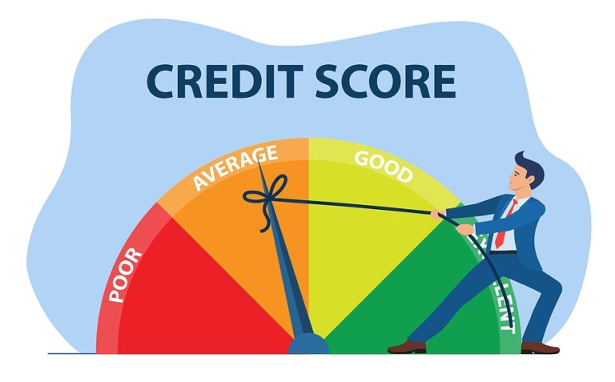
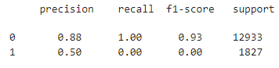
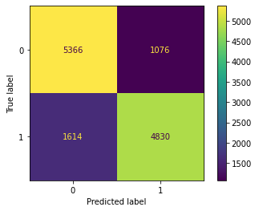
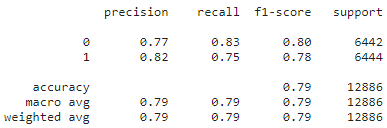
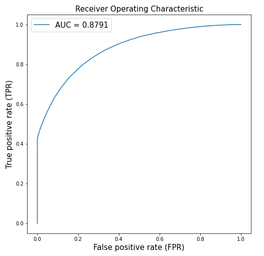
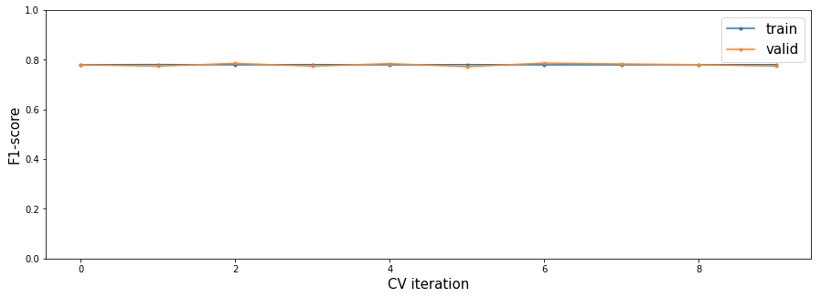

Предсказание вероятности дефолта банковского клиента
====================================================
## Bank credit scoring

[SkillFactory DST Project at Kaggle](https://www.kaggle.com/andreikukunov/baseline-v1-sf-scoring-ak)

# Что сделано
#### Цель данного учебного Data Science проекта
 * посторить модель машинного обучения на имеющихся реальных данных
 * достичь наилучших показателей по соответствующим метрикам качества модели

#### Достигнутые результаты:

**Метрики базовой обработки и базовой модели:**

**Метрики после проведенной работы (максимальные):**

Confusion Matrix

Classification Report

Roc Curve

Cross Validation Metrics

> **Это свидетельствует:**
> * о точности предстказания как возможного дефлота клиента, так и не-дефолта
> * что эта точность в среднем равна 79%
> * что пере/недо-обучения нет (показала кросс-валидация)

#### Что сделано:
> * отсеивание коррелирующих и менее значимых признаков
> * логарифмизация и нормализация численных данных
> * полиноминальные признаки (жаль, они неинтрпретируемы и могут быть отключены в финальной версии)
> * балансирование тестовой выборки
> * подбор гиперпараметров модели
### Немного аналитики
#### Интересные наблюдения из анализа датасета:
  * Один из наиболее значимых признаков -- рейтинг БКИ (score_bki)
> признаки (из всех), которые наиболее заметно меняются вместе с ним : 
> * decline_app_cnt 
> * bki_request_cnt
> * education_ACD
> * car_type
 
* Медиана возраста (age) дефолтных клиентов банка чуть ниже
 > молодые больше рискуют при меньшем опыте

* Количество отклоненных заявок (decline_app_cnt): 
 >  * значения сосредоточены у ноля
 >  * Банк отклоняет большинство рискованных заявок
 >  * 7% клиентов без отклоненных заявок оказываются дефолтными
 
* Количество запросов кредитных историй (bki_request_cnt) у дефолтных скорее отлично от 0
 > им есть о чем беспокоиться
 
* Доход (income) дефолтных ожидаемо ниже
 
 
#### Коэффициенты модели

> Увеличение значения каждого признака на 1 (или положительное значение у бинарного) увеличивает вероятность дефолта клиента на значение 'coef'

Структура работы
=================
**(оглавление)**

- [Основная часть работы](#Основная-часть-работы)
    + [Подготовка среды и загрузка датасета](#Подготовка-среды-и-загрузка-датасета)

  * [Первый взгляд на данные](#Первый-взгляд-на-данные)
    + [Названия признаков и их смысл:](#Названия-признаков-и-их-смысл:)
      - [Общая первичная обработка датасета](#Общая-первичная-обработка-датасета)

  * [Обзорный анализ](#Обзорный-анализ)
    + [Целевая переменная и отношения с ней](#Целевая-переменная-и-отношения-с-ней)
    + [Смотрим на числовые переменные](#Смотрим-на-числовые-переменные)
    + [Смотрим на категориальные переменные](#Смотрим-на-категориальные-переменные)

  * [Обработка признаков](#Обработка-признаков)

  * [Деление и модель](#Деление-и-модель)
    + [Лучший вариант модели](#Лучший-вариант-модели)
    + [Разглядываем коэффициенты модели](#Разглядываем-коэффициенты-модели)
    + [Кросс-валидация: проверяем на переобучение](#Кросс-валидация:-проверяем-на-переобучение)

	
- [Submission](#submission)

- [Приложение: отчет о датасете от pandas_profiling](#Приложение:-pandas_profiling)