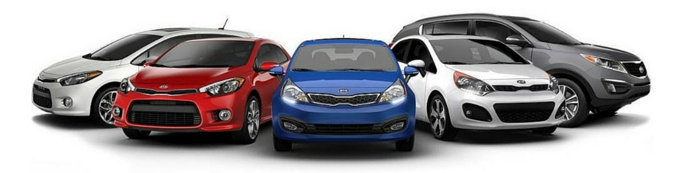

Классификация автомобилей по фотографии
===============================================================

[Ноутбук на Kaggle](https://www.kaggle.com/andreikukunov/sf-car-classification-ak)

### Лучшие значения метрик:
| val_accuracy | Kaggle Score | 
| :-: | :-: |
| 0.9747 | [0.9703](https://www.kaggle.com/competitions/sf-dl-car-classification/leaderboard?search=andreikukunov) | 

### Цель данного учебного Data Science проекта
 * изучить реальную задачу компьютерного зрения на практике

 

## Что сделано

> **Выбор предобученной модели**
> * на основе статистических данных отобраны несоклько наиболее эффективных моделей от EfficientNet: B3, B5, B6, B7
> * в дальнейшем, после серии тестовых обучений выбрана самая эффективная из них (для данной задачи) -- EfficientNetB3

> **Аугментация изображений**
> * Опробованы библиотеки: `albumentations` и `ImageDataGenerator`
> * Выбраны аугментаций, нилучшим образом имитирующие естественные условия съемки: освещение, вращение, переворот, сдвиг
> * Подобраны их естественные параметры
> * Эксперименты с моделями показали, что обработка albumentations для данной задачи более затратна по времени, а результат не улучшает. 
> * Выбор пал на более удобный `ImageDataGenerator`
> * Выполнена также TTA (Test-time augmentation)

> **Размер изображений**
> * Опробованы стандартные размеры изобажений (для лучшей пиксельности): 160x213 ; 240x320 ; 480x640
> * а также -- квадратные (для математики): 320x320; 480x480
> * Наиболее эффективными оказались испробованные квадратные размеры.

> **Настройка процесса обучения**
> * Размер валидационой выборки -- 0.3
> * Callbacks: ReduceLROnPlateau, EarlyStopping, tensorboard_callback

> **FineTuning и до-обучение на разных размерах изображений**
> * Опробовaны разные степени разморозки слоев предобученной модели: 0%, 10%, 33%, 50%, 66%, 100%
> * Опробовано разное количество этапов обучения: от 1 до 3

> **Усреднение предсказаний**
> * Предсказания выполнены 5 раз и усреднены
  
 
  
## Результаты
> **Наилучшая комбинация методов и параметров обучения (метрика/время):**  
> EfficientNetB3, 100% слоев разморожены на всех этапах FineTuning (stages)  
> (Колонка val_accuracy в таблице: first epoch  --> last epoch)

| Stage | Image_Size | max_Lr | min_Lr | epochs |  each epoch time | time total | val_accuracy | Kaggle Score |
| -: | :- | :- | :- | :- | :- | :- | :- | :- |
| 1 | 320x320 | 0.0005 | 0.00005 | 15 | 8 minutes | 120 minutes | 0.9262 --> 0.9717 | 0.9655 |
| 2 | 480x480 | 0.00005 | 0.00001 | 5 | 17 minutes | 85 minutes | 0.9721 --> **0.9747** | **0.9703** |

 

> **Другие варианты обучения:**

| Stage | base_model.trainable | Image_Size | max_Lr | min_Lr | epochs | each epoch time | time total | val_accuracy |
| -: | :- | :- | :- | :- | :- | :- | :- | :- |
| 1 | B3 10% | 160x213 | 0.0009 | 0.0001 | 5 | 3.6 minutes | 18 minutes | 0.8407 --> 0.9434 |
| 2 | B3 50% | 240x320 | 0.0002 | 0.0001 | 5 | 6 minutes | 30 minutes | 0.9614 --> 0.9657 |
| 3 | B3 100% | 480x640 | 0.0001 | 0.00005 | 5 | 22 minutes | 110 minutes | 0.9657 --> **0.9715** |
| - | - | - | - | - | - | - | - | - |
| 1 | B5 0% | 160x213 | 0.0003 | 0.00001 | 5 | 5 minutes | 25 minutes | 0.8791 --> 0.9417 |
| 2 | B5 33% | 160x213 | 0.0003 | 0.00001 | 5 | 5 minutes | 25 minutes | 0.9507 --> 0.9513  |
| 3 | B5 100% | 240x320 | 0.0003 | 0.00001 | 5 | 6.6 minutes | 33 minutes | 0.9633 --> 0.9659  |
| 4 | B5 100% | 480x640 | 0.0003 | 0.00001 | 5 | 48 minutes | 240 minutes | 0.9675 --> **0.9738**  |
| - | - | - | - | - | - | - | - | - |
| 1 | B7 0% | 160x213 | 0.0005 | 0.00005 | 10 | 5.3 minutes | 53 minutes | 0.8523 --> 0.9614 |
| 2 | B7 33% | 160x213 | 0.0003 | 0.00001 | 5 | 5.4 minutes | 27 minutes | 0.9443 --> 0.9533  |
| 3 | B7 100% | 240x320 | 0.0001 | 0.00001 | 4 | 13.5 minutes | 54 minutes | 0.9636 --> 0.9691  |
| 4 | B7 100% | 480x640 | 0.0005 | 0.00005 | 5 | 62 minutes | 310 minutes | 0.9711 --> **0.9745**  |

> Остальные результаты испытаний записаны в соответствующих ячейках ноутбука

