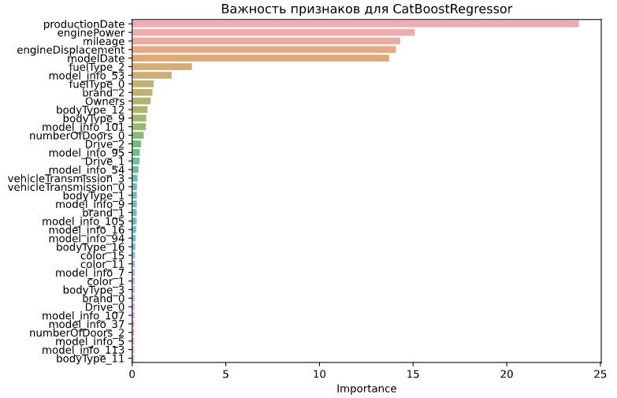
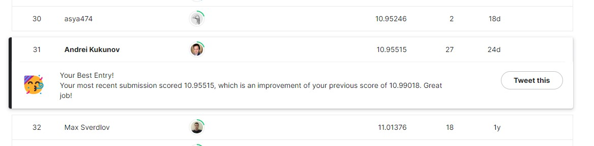

Прогнозирование стоимости автомобиля по характеристикам
====================================================

*Это -- **продолжение ML проекта** от [SkillFactory DST](https://github.com/gravek/Skillfactory/tree/master/project_5), дополненного здесь дугими **ML** и **DL** моделями*

[Ноутбук на Kaggle](https://www.kaggle.com/andreikukunov/ak-sf-dst-car-price-part2-master)

### Лучшие значения метрик:
> MAPE   **9.88**  
> [SCORE **10.95**](https://www.kaggle.com/competitions/sf-dst-car-price-prediction-part2/leaderboard?search=andreikukunov) (30-е место на август '22)

### Цель данного учебного Data Science проекта
 * посторить модели машинного и глубокого обучения на реальных данных
 * достичь наилучших показателей по метрикe качества модели

## Что сделано

### Анализ датасета

> **Отличия от датасета для предыдущей ML работы:**
> * меньшая неоднородность данных: присутствуют только премиальные марки автомобилей (BMW, Audi и т.п.)
> * датасет довольно чистый: почти без пропусков и некорректно введенных или испорченных данных

> **Отличия от датасета для предыдущей ML работы:**
> * Количественные признаки не имеют нормального распределения
> * Но и выбросы незначительны

### Предобработка

> **Отбор колонок**
> * исключены признаки, несущее информацию, имеющуюся в других признаках (количество дверей корелирует с типом кузова, к тому же, оно может быть неверно указано владельцем)

> **Очистка и коррекция данных**
> * некоторые текстовые признаки, содержащие числовую информацию, очищены и преобразованиы в числовые
> * обнаружен ризнак с подвохом ("Владельцы"), в котором преобразования не выполнялись из-за невидимых символов 
> * пустоты в данных заполнены или удалены  
> * лемматизация много-текстового признака (для сетей)

> **Создание и преобразование признаков**
> * год изобретения модели --> в возраст модели
> * год выпуска автомобиля --> в возраст автомобиля
> * интенсивность эксплуатации машины (пробег/возраст)
> * модели автомобилей с дорогими параметрами, особо влияющими на цену
> * другие преобразования, не принесшие положительноо результата (см. код)

### Использованы модели:
> **ML**
> * CatBoostRegressor -- хороший результат с параметрами "из коробки"
> * CatBoost Cross Validation -- лучший результат без блендинга
> * LGBMRegressor -- схожий результат с CatBoostRegressor

> **DL**
> * Простая модель Tabular NN
> * NLP & MLP (Multiple Inputs) -- сделана лемматизация текста объявлений, настроены параметры callbacks
> * NLP(SBERT) & MLP (Multiple Inputs) -- применена предобученная модель `sbert_large_nlu_ru`
> * ComputerVision & NLP & MLP (Multiple Inputs) -- настроена аугментация и параметры callbacks

> **Наиболее важные признаки для CatBoost:**
> * возраст автомобиля
> * возраст модели
> * мощность двигателя
> * пробег
> * объём двигателя

### Метрики при валидации:
| Что сделано | MAPE | Score |
| :- | :-: | :-: |
| Наивная модель (средняя цена по главным признакам) | 19.88 | - |
|  |  |  |
| CatBoostRegressor с базовой обработкой признаков | 13.06 | - |
| CatBoostRegressor с числовыми двигателями и л.с. | 11.97 | - |
| CatBoostRegressor с датами, превращенными в возраст и RobustScaler | 11.97 | - |
| CatBoostRegressor с RobustScaler | 11.97 | - |
| CatBoostRegressor с признаком 'xDrive' | 12.59 | - |
| CatBoostRegressor с логарифмированным таргетом | **11.02** | 12.09 |
| Сatboost_CV | **10.67** | - |
| LGBM | 11.24 | - |
| Сatboost + LGBM  (blend prediction) | 10.89 | - |
|  |  |  |
| Tabular базовый | 11.64 | - |
| Tabular с обработкой | 11.27 | - |
| Tabular + LGBM (blend prediction) | **10.65** | - |
|  |  |  |
| NLP & MLP (Multiple Inputs) базовый | 11.60 | 11.93 |
| NLP & MLP с RobustScaler + лемматизация | 11.13 | - |
| NLP & MLP + Сatboost_CV  (blend prediction) | 10.25 | 11.13 |
| NLP & MLP + CatBoostRegressor + Сatboost_CV  (blend) | 10.25 | 11.27 |
| SBERT & MLP + Сatboost_CV  (blend prediction) test_size=0.15  | **9.88** | 10.98 |
| SBERT & MLP + Сatboost_CV  (blend prediction) test_size=0.30 | 10.75 | **10.95** |
|  |  |  |
| ComputerVision & NLP & MLP (Multiple Inputs) | 11.60 | - |
| ComputerVision & NLP & MLP  +  Сatboost_CV  (blend prediction) | 10.37 | 11.37 |
| ComputerVision & NLP & MLP  +  CatBoostRegressor  +  Сatboost_CV  (blend) | 10.25 | 11.27 |

-----------------------------------------------------------------

## Выводы
> **Наиболее полезным для предсказания оказалось:** 
> * отбор признаков
> * очистка и обработка признаков
> * логорифмизация таргета (логарифмизация признаков не улучшила результат)
> * использование предобученной "смысловой" модели NLP
> * блендинг предсказаний от моделей разной природы

> **Как еще улучшить результат:**
> * сделать проброс важных признаков
> * применить более специфические модели для обработки фотографий

-----------------------------------------------------------------

## Содержание:

- [Setup&Load](#setup-load)
- [DATA](#data)
  * [Model 0, "наивная"](#model-0-----------)
- [EDA](#eda)
- [PreProc Tabular Data](#preproc-tabular-data)
  * [Split data](#split-data)
- [ML](#ml)
  * [CatBoostRegressor](#catboostregressor)
  * [CatBoost CV](#catboost-cv)
  * [LGBM](#lgbm)
- [DL](#dl)
  * [Simple Dense NN](#simple-dense-nn)
  * [NLP + Multiple Inputs](#nlp---multiple-inputs)
    + [Лемматизация, Токенизация](#-------------------------)
    + [Построение модели](#-----------------)
  * [Transformers + MLP](#transformers---mlp)
  * [Blend CatBoost + nn2](#blend-catboost---nn2)
  * [NLP + ComputerVision](#nlp---computervision)
- [Blend ALL](#blend-all)
